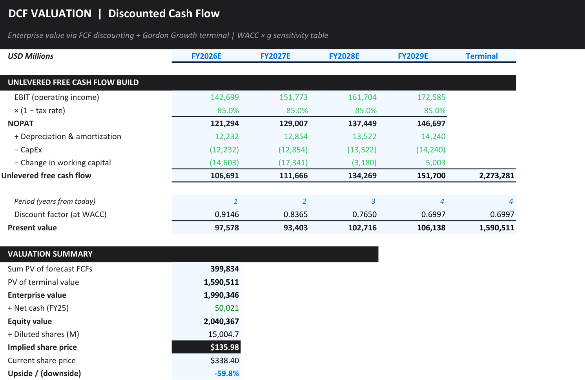
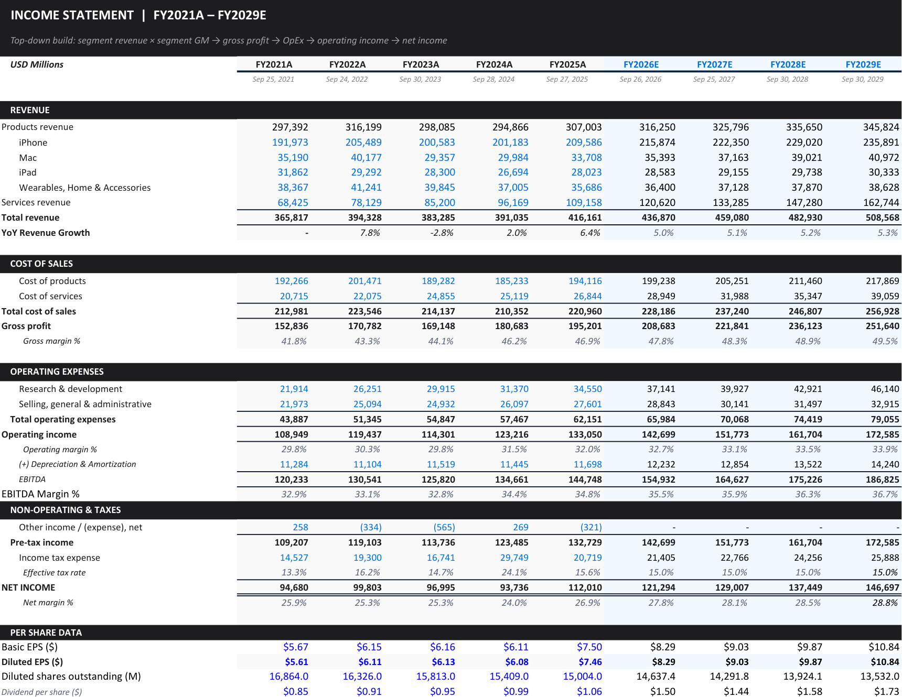

# Apple Inc. (AAPL): three-statement model and DCF valuation

A three-statement model of Apple for fiscal years 2021 to 2025, forecast to 2029 under Bear, Base and Bull
scenarios, and valued by unlevered DCF. Every historical line cites the 10-K page it came from; on the Base
scenario the DCF gives **$135.98** a share against a **$338.40** close on 28 Sep 2026.

## Workbook tabs

| Tab | Contents |
|---|---|
| Dashboard | Headline metrics and charts |
| Assumptions | Every driver: segment growth and margins, operating expenses, working-capital days, WACC inputs, terminal growth, share count, reference price, and the scenario switch in `B62` |
| IS / BS / CFS | Statements, five years historical (FY21 to FY25) and four projected (FY26E to FY29E) |
| Ratios | Derived ratios |
| DCF | Free cash flow build, discounting, valuation summary, two sensitivity grids, tornado and football field |
| Validation | Line-by-line 10-K cross-reference, structural checks and forecast sanity bands |

## Valuation

| Base scenario | Value |
|---|---:|
| WACC (cost of equity 10.0% at beta 1.1, after-tax cost of debt 3.4%, 90/10 weights) | 9.34% |
| Terminal growth | 2.5% |
| Enterprise value | $1.99tn |
| Implied share price | **$135.98** |
| Bear / Bull implied price | $75.46 / $255.75 |
| WACC implied by the $338.40 market price, same cash flows | 5.26% |

The terminal value is the Gordon value at the end of year 4, discounted four periods, and makes up 80% of
enterprise value. The WACC × growth grid is centred on the active scenario, so its centre cell equals the
headline price. The football field compares the DCF with discounted P/E and EV/EBITDA ranges, the 52-week
closing range and the analyst range (44 analysts, $215 to $405, stockanalysis.com, 29 Sep 2026).

Key Base assumptions and their basis:

- **Products gross margin 37.0%**: the FY24-FY25 average (37.2%, 36.8%).
- **Services gross margin 76%**: just above FY25's 75.4%, on a trend rising about 1.4 points a year since FY21.
- **Tax rate 15%** on the income statement, for NOPAT and for WACC: the FY21-FY25 average excluding FY24's
  one-off EU State Aid charge (14.9%).

## Validation

- **Balance sheet balances** (assets minus liabilities minus equity is zero) in all nine years.
- **Cash flow ties**: ending cash each year equals the next year's beginning cash and the balance-sheet cash.
- **Transcription**: the Validation tab's copy of each historical line matches the statement cell it came from.
- **Independent rebuild**: `../validate_model.py` re-derives 19 identities, traces 49 line items to their source
  cells and rebuilds 16 valuation figures from the forecast statements and inputs.

The link to the filings is carried by the Source column's page citations; the filings for FY23 onward are in
`Source_filings/`, and FY21 and FY22 cite the FY2022 and FY2023 10-Ks on SEC EDGAR.

## Modelling conventions

- One assumptions sheet drives every tab; inputs are colour-coded and calculated cells locked.
- Scenario drivers are chosen with `CHOOSE(MATCH(Scenario, ...))`, so switching `B62` restates the forecast,
  statements and valuation together.
- No macros, external links or add-ins; the file opens in Excel or LibreOffice Calc.

## Notes

- The forecast sanity bands are wide (operating margin 25% to 40%), so passing them is a weak test.
- `Source_filings/` includes the FY26 Q1 statements, which the model does not yet use.

## License

MIT. See [`LICENSE`](../LICENSE).

Alven Yuka · [LinkedIn](https://www.linkedin.com/in/alven-yuka-610b78174/) · [Email](mailto:alvenyuka2@gmail.com)
