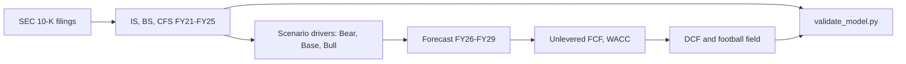

# Financial-Analyst

Three-statement models and DCF valuations built from primary-source SEC filings, with an independent Python
validator that rebuilds the statements and the valuation outside Excel. On Apple, 19 of 19 accounting
identities, 49 of 49 transcribed line items and 16 of 16 valuation figures reconcile.

[](LICENSE)
[](https://www.microsoft.com/en-us/microsoft-365/excel)
[](https://github.com/alvenyuka/Financial-Analyst/actions/workflows/ci.yml)


## Overview

Investment and credit decisions often rest on spreadsheet models, and a spreadsheet's own "all checks pass"
cell is computed by the same formulas it is meant to check. These models are built to be audited: every
historical figure cites the filing and page it came from, inputs sit on one assumptions sheet, and a separate
program recomputes the arithmetic from the raw cells.

The first complete model covers Apple Inc. for fiscal years 2021 to 2025 with a forecast to 2029, driven by a
Bear / Base / Bull scenario engine, and values the company by unlevered DCF with a Gordon growth terminal value.

## Results

Apple, Base scenario, reference price $338.40 (close on 28 Sep 2026):

| Measure | Value |
|---|---:|
| DCF implied share price (WACC 9.34%, terminal growth 2.5%) | **$135.98** |
| Bear / Base / Bull DCF | $75 / $136 / $256 |
| WACC implied by the market price on the same cash flows | **5.26%** |
| Terminal value share of enterprise value | 80% |
| Analyst targets, low / median / high (44 analysts) | $215 / $340 / $405 |

- On base-case cash flows the model values Apple well below its market price. The market price is consistent
  with a discount rate of about 5.3%, roughly 4 points below the model's 9.3% WACC, or with much faster growth
  than the base case assumes.
- The historical statements reconcile exactly, and every line traces to the 10-K page it was taken from.
- The valuation is dominated by the terminal value (80% of enterprise value), so the WACC and growth
  assumptions matter more than the forecast years.

## Approach



1. **Historicals** transcribed from Apple's 10-K filings and press releases, each cited to a page.
2. **Forecast** from segment revenue growth and gross margins, operating expense growth, working-capital days
   and capital-return policy, switched by the scenario engine.
3. **Valuation**: unlevered free cash flow discounted at a CAPM-based WACC, a terminal value at the end of year
   4, sensitivity grids and a football field of methods.
4. **Validation**: `validate_model.py` re-derives the statement identities, traces each transcribed line to its
   source cell and rebuilds the DCF, and its tests break a copy of the model to prove each fault is caught.


## Repository structure

```
Apple/Apple_Financial_Model.xlsx   the model: assumptions, statements, DCF, validation tab
Apple/Source_filings/              the 10-K and press-release PDFs behind the historicals
Apple/README.md                    model-specific assumptions and sensitivity tables
validate_model.py                  independent validator (statements and valuation)
tests/                             fault-injection tests for the validator
```

## Getting started

```bash
pip install -r requirements.txt
python validate_model.py      # rebuild the statements and the valuation, report the implied WACC
python -m pytest              # prove the validator catches injected faults
```

Or open `Apple/Apple_Financial_Model.xlsx` in Excel or LibreOffice Calc and change the scenario on the
Assumptions sheet.

## Notes

- Forecast drivers are assumptions: the Base products gross margin is the FY24-FY25 average and the tax rate
  the FY21-FY25 average excluding FY24's one-off EU State Aid charge.
- Safaricom and Equity Group, both listed in Nairobi, are the next models.

## License

MIT. See [`LICENSE`](LICENSE). Sources: SEC EDGAR filings (CIK 0000320193), Apple investor relations, and
stockanalysis.com for the analyst range.

Alven Yuka · [LinkedIn](https://www.linkedin.com/in/alven-yuka-610b78174/) · [Email](mailto:alvenyuka2@gmail.com)
