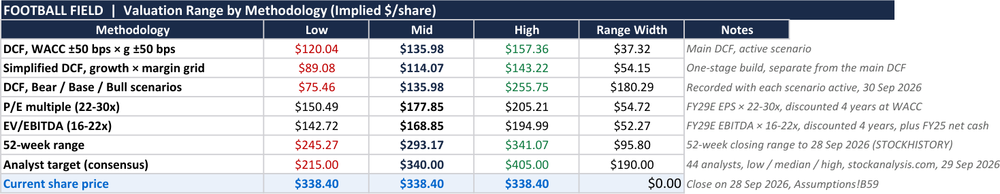
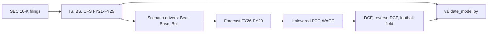
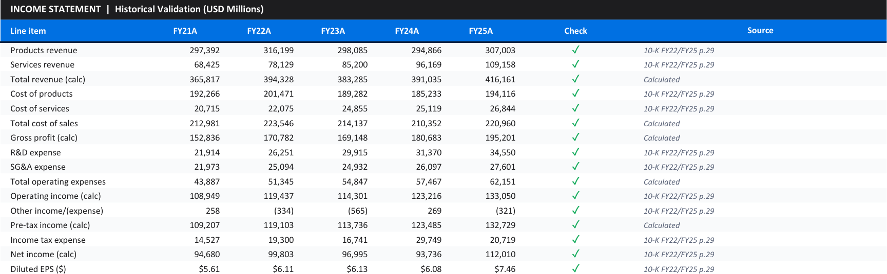

# Financial-Analyst

Three-statement models and DCF valuations built from primary-source SEC filings, with an independent Python
validator that rebuilds the statements and the valuation outside Excel. On Apple, every accounting identity,
transcribed line item and valuation figure reconciles, and the model shows that the **$338.40 share price
implies a 5.26% discount rate**, about 4 points below a CAPM-based 9.34%.

[](LICENSE)
[](https://www.microsoft.com/en-us/microsoft-365/excel)
[](https://github.com/alvenyuka/Financial-Analyst/actions/workflows/ci.yml)



## Contents

1. [Business problem](#business-problem)
2. [Dataset](#dataset)
3. [Methodology](#methodology)
4. [Results](#results)
5. [Business impact](#business-impact)
6. [Key insights](#key-insights)
7. [Limitations](#limitations)
8. [Repository structure](#repository-structure)
9. [How to run](#how-to-run)

## Business problem

Investment, credit and budgeting decisions rest on spreadsheet models, and a spreadsheet's own "all checks
pass" cell is computed by the same formulas it is meant to check. A reviewer needs to know three things before
relying on a valuation: that the historical figures match the filings, that the statements are internally
consistent, and what the market price implies about the assumptions.

This repository builds models to be audited. Every historical figure cites the filing and page it came from,
every input sits on one assumptions sheet, and a separate program recomputes the arithmetic from the raw cells.
The first complete model covers Apple Inc.

## Dataset

| Source | Coverage |
|---|---|
| Apple 10-K filings (SEC EDGAR, CIK 0000320193) | Fiscal years 2021 to 2025: income statement, balance sheet, cash flow statement |
| Apple investor relations | Segment revenue and gross margin (Products, Services) |
| Market data | Close of $338.40 on 28 Sep 2026; 52-week range $245.27 to $341.07 |
| Analyst targets | 44 analysts, low $215, median $340, high $405 (stockanalysis.com, 29 Sep 2026) |

The filings for fiscal 2023 onward are in `Apple/Source_filings/`; fiscal 2021 and 2022 cite the fiscal 2022 and
2023 10-Ks. The forecast runs to fiscal 2029.


## Methodology



1. **Historicals** transcribed from the 10-K filings and press releases, each line cited to a page.
2. **Forecast** from segment revenue growth and gross margins, operating-expense growth, working-capital days
   and capital returns, switched between Bear, Base and Bull by one cell (`CHOOSE(MATCH(...))`).
3. **Valuation.** Unlevered free cash flow discounted at a CAPM-based WACC (cost of equity 10.0% at beta 1.1,
   after-tax cost of debt 3.4%, 90/10 weights), a Gordon terminal value at the end of year 4, two sensitivity
   grids and a football field comparing methods.
4. **Reverse DCF.** The validator solves for the discount rate at which the same cash flows justify the market
   price.
5. **Independent validation.** `validate_model.py` re-derives the statement identities, traces each transcribed
   line to its source cell and rebuilds the DCF; its tests break a copy of the model to prove each fault is caught.

## Results

| Apple, Base scenario | Value |
|---|---:|
| Accounting identities reconciled | 19 of 19 |
| Transcribed line items traced to source cells | 49 of 49 |
| Valuation figures rebuilt independently | 16 of 16 |
| Enterprise value | $1.99tn |
| DCF implied share price | **$135.98** |
| Bear / Bull implied price | $75.46 / $255.75 |
| Terminal value share of enterprise value | 80% |


## Business impact

What the model tells an investment or credit committee about Apple at $338.40 (all figures printed by
`validate_model.py`):

| Measure | Value |
|---|---:|
| Equity value, Base DCF | $2.04tn |
| Market value at $338.40 (15.0bn diluted shares) | $5.08tn |
| Premium the market pays over the Base case | **$3.04tn** |
| Discount rate the market price implies | **5.26%**, against 9.34% |
| Bull-case price against market | $255.75, 24% below |

At a 9.34% cost of capital the market price cannot be reached even in the Bull case. It is consistent with
investors accepting about a 5.3% return on Apple's cash flows, or with growth well above every scenario here.
A committee can use the model to see which assumption carries the price, rather than argue about the output.

## Key insights

- **The discount rate carries the valuation.** The terminal value is 80% of enterprise value, so a half-point
  change in WACC moves the price more than any forecast-year assumption.
- **Services margins drive the forecast.** Products gross margin is held at its fiscal 2024-2025 average of
  37%, while Services sits at 76% on a trend rising about 1.4 points a year.
- **Spreadsheet checks need an outside check.** An earlier version of the workbook discounted the terminal value
  by the wrong number of periods, a step the workbook's own Validation tab does not test; the validator now
  rebuilds it,
  and its tests corrupt one cell at a time to confirm each break is reported.



## Limitations

- **Forecast drivers are assumptions.** The tax rate is the fiscal 2021-2025 average excluding fiscal 2024's
  one-off EU State Aid charge; the sanity bands on forecasts are wide, so passing them is a weak test.
- **One company so far.** Safaricom and Equity Group, both listed in Nairobi, are the next models.
- **The fiscal 2026 first-quarter statements** are in `Source_filings/` but not yet used.

## Repository structure

```
Apple/Apple_Financial_Model.xlsx   the model: assumptions, statements, DCF, validation tab
Apple/Source_filings/              the 10-K and press-release PDFs behind the historicals
Apple/README.md                    model-specific assumptions and tabs
validate_model.py                  independent validator (statements, valuation, reverse DCF)
tests/                             fault-injection tests for the validator
images/                            screenshots of the model
```

## How to run

```bash
pip install -r requirements.txt
python validate_model.py      # rebuild the statements and the valuation, report the implied WACC
python -m pytest              # prove the validator catches injected faults
```

Or open `Apple/Apple_Financial_Model.xlsx` in Excel or LibreOffice Calc and change the scenario in cell `B62` of
the Assumptions sheet.

## Documentation

The Apple model's tabs and assumptions are described in [`Apple/README.md`](Apple/README.md) and the full method in
[`docs/METHODOLOGY.md`](docs/METHODOLOGY.md).

## License

MIT. See [`LICENSE`](LICENSE). Sources: SEC EDGAR filings (CIK 0000320193), Apple investor relations, and
stockanalysis.com for the analyst range.

Alven Yuka · [LinkedIn](https://www.linkedin.com/in/alven-yuka-610b78174/) · [Email](mailto:alvenyuka2@gmail.com)
